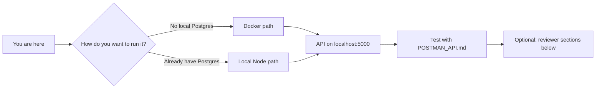

# Multi-Tenant CRM — Backend

**What this is:** a **NestJS** API with **PostgreSQL** (Prisma), **JWT** auth, **per-organization data isolation**, and CRM features: customers (search, pagination, soft delete, assignment), notes, and an append-only **activity log**.

**What this document is for:** telling you **where to start**, **how to get a working API** (Docker or local Node), and **where to read** if you are grading the assignment.  
**API routes & Postman:** open **[`POSTMAN_API.md`](./POSTMAN_API.md)** — that file is the HTTP contract; this README is setup + reasoning.

---

## How to read this page (don’t skip)



*(If the diagram does not render in your viewer, use the numbered table right below — same story.)*

| Step | Section | Purpose |
|------|---------|---------|
| **1** | [Start here (pick one path)](#start-here-pick-one-path) | Choose **Docker** or **local** — only follow **one** path to avoid confusion |
| **2** | [You are done when](#you-are-done-when) | How to know the server is actually up |
| **3** | [Test the API](#test-the-api) | Postman / curl — links to route docs |
| **4** | [For code reviewers](#for-code-reviewers) | Concurrency, performance, production hardening (assignment criteria) |
| **5** | [Reference](#reference) | Prisma commands and npm scripts — look up as needed |

**End of the “getting started” story:** you have the API responding on **`http://localhost:5000`** (or your `PORT`) and you can call **`/api/v1/...`** as documented. Everything after that is optional depth.

---

## Start here (pick one path)

You only need **one** of the two paths below.

| Path | Best when | Jump to |
|------|-----------|---------|
| **Docker** | You want Postgres + API in containers; minimal local install (Docker only) | [Docker path](#docker-path) |
| **Local Node** | You already have PostgreSQL and want `pnpm dev` with hot reload | [Local path](#local-path) |

> **Folder:** all commands assume you are inside the **`server`** directory (where `package.json` and `docker-compose.yml` live).

---

### Docker path

**Goal:** Postgres and the API run in Docker; you hit the API at **`http://localhost:5000`**.

1. Install **[Docker Desktop](https://www.docker.com/products/docker-desktop/)** (or Docker Engine + Compose on Linux) and ensure it is **running**.
2. In a terminal:
   ```bash
   cd server
   cp .env.example .env
   ```
3. Edit **`.env`**. The critical rule for Compose: Postgres is the service named **`db`**, so the app must connect to host **`db`**, not `localhost`:
   - Set `DATABASE_USER`, `DATABASE_PASSWORD`, `DATABASE_NAME` (used by the `db` container).
   - Set `DATABASE_URL` to match, with **`@db:5432`** in the URL, e.g.  
     `postgresql://postgres:strongpassword@db:5432/postgres`
   - Set `JWT_SECRET`, `CORS_ORIGINS`, and the rest using `.env.example` as a checklist.
4. Start the stack:
   ```bash
   docker compose --env-file ./.env up --build
   ```
   First run builds the image (can take a few minutes). Logs should show migrations, then the server starting.  
   **Detached mode:** `docker compose --env-file ./.env up --build -d` or `pnpm docker:start`.
5. **Stop:** `docker compose down`. **Wipe DB volume:** `docker compose down -v`.

**If something breaks:**

- **Port in use:** change `5000:5000` or `5432:5432` in `docker-compose.yml` and use the new host port in the browser/Postman.
- **App can’t connect to DB:** `DATABASE_URL` must use host **`db`** and the same credentials as `DATABASE_*`.

---

### Local path

**Goal:** you run Postgres yourself; the API runs with **`pnpm dev`**.

1. Install **Node.js** (LTS) and **pnpm** (`corepack enable` or install pnpm).
2. Create a database in PostgreSQL and note the connection string.
3. In a terminal:
   ```bash
   cd server
   cp .env.example .env
   ```
4. Set **`DATABASE_URL`** to your database (usually `localhost` as host). Set **`JWT_SECRET`**, **`PORT`**, **`CORS_ORIGINS`**, etc.
5. Install deps and apply schema:
   ```bash
   pnpm install
   pnpm prisma:migrate:dev
   ```
6. Optional demo data: **`pnpm prisma:seed`** (uses **`SEED_ADMIN_PASSWORD`**; see `prisma/seed.ts`).
7. Run the API:
   ```bash
   pnpm dev
   ```
8. Production-style (no watch): `pnpm build` then `pnpm start:prod`.

---

## You are done when

| Check | What to do |
|-------|------------|
| Server listens | Open **`http://localhost:5000`** (or your `PORT`) — you should not get “connection refused”. |
| API responds | `GET /api/v1/organizations` **without** a token should return **401** (unauthorized), not **5xx** — that means the app and routing work. |
| Next step | Use **[`POSTMAN_API.md`](./POSTMAN_API.md)** — login, then Bearer token on protected routes. |

---

## Test the API

1. Keep the server running (Docker or `pnpm dev`).
2. Follow **`POSTMAN_API.md`**: login → copy **access token** → **Authorization: Bearer …** → call customers, users, etc.

---

## For code reviewers

These items map to the **assignment brief**: multi-tenant CRM, concurrency, scale assumptions, and a production-oriented extra. Open each block only if you care about that topic.

<details>
<summary><strong>Multi-tenancy & soft delete</strong></summary>

- **Isolation:** the JWT carries **`organizationId`**. Services filter by it so users never read another organization’s rows.
- **Soft delete:** the default customer **list** only includes rows with **`deletedAt` null**. **Notes** and **activity log** rows are kept; **restore** clears **`deletedAt`** so the customer shows up again.

</details>

<details>
<summary><strong>Concurrency — max 5 active customers per user</strong></summary>

- **Active** means **`deletedAt` is null**. Each assignee may have at most **5** active customers.
- **Enforcement:** inside a **transaction**, we **count** active rows for the relevant user and reject with **400** if the limit would be exceeded (create, assign, restore).
- **Race conditions:** create / assign / restore use **`SERIALIZABLE`** isolation so two concurrent requests cannot both observe “room left” and commit one row too many (which could happen under **`READ COMMITTED`** alone).
- **Code:** `src/modules/customer/customer.service.ts`.

</details>

<details>
<summary><strong>Performance — large orgs (e.g. on the order of 100k customers)</strong></summary>

- **Indexes** on `customers` in `prisma/schema.prisma` support org filters, soft-delete filtering, search, and assignee counts (e.g. `organizationId`, composite with `deletedAt` / `name`, `assignedToId`, unique `(organizationId, email)`).
- **N+1:** customer **detail** loads notes in **one** query (`include`); the **list** endpoint does **not** load notes per row.
- **Pagination:** list uses **`take` / `skip`** with **`count`** in parallel — not unbounded loads.
- **Trade-off:** deep **offset** pages can get slower; a future improvement is **cursor-based** pagination.

</details>

<details>
<summary><strong>Production-style improvement</strong></summary>

- **Rate limiting:** **`@nestjs/throttler`** is registered globally (**`ThrottlerGuard`**) with a default budget (**100 requests per 60 seconds** per key) — see `app.module.ts`. This limits abusive or accidental tight loops before they stress the DB or auth stack.
- **Also present:** **Helmet** (HTTP headers), a **logging interceptor**, and **Zod**-validated configuration.

</details>

<details>
<summary><strong>Activity log</strong></summary>

Customer lifecycle and note events are written to **`activity_logs`** (`entityType`, `entityId`, `action`, `performedById`, `createdAt`) from the same flows as the REST API — no separate “log only” routes required for persistence.

</details>

---

## Reference

<details>
<summary><strong>Prisma commands</strong> (run from <code>server</code>)</summary>

| Command | In plain terms (why run it) |
|---------|----------------------------|
| `pnpm prisma:migrate:dev` | You **changed the database layout** in `schema.prisma`. This **updates your dev database** and **saves a migration file** so the change is tracked. |
| `pnpm prisma:migrate:deploy` | On a **server or Docker**: apply those **saved** migrations. It **does not invent** new ones — use after deploy or when the container starts. |
| `pnpm prisma:generate` | Refreshes the **auto-generated database code** your app imports. Run if things feel “out of sync” after schema changes (also runs on `pnpm install`). |
| `pnpm prisma:seed` | **Inserts demo data** (orgs, users, customers, etc.) using `prisma/seed.ts` — handy so you are not staring at an empty DB. |
| `pnpm prisma:studio` | Opens a **simple web UI** to **see and edit** rows in the database — like a mini Excel for your tables. |
| `pnpm prisma:push` | **Quick test:** push your schema to the DB **without** a migration file. Fine for playing around; for real work prefer **`migrate:dev`**. |
| `pnpm prisma:pull` | Your database **already exists** elsewhere; this **pulls its structure** into `schema.prisma` so Prisma matches that DB. |

**Usual order when you edit the schema:** `pnpm prisma:migrate:dev` → restart the API → if types still look wrong, `pnpm prisma:generate`.

</details>

<details>
<summary><strong>npm scripts</strong></summary>

| Script | In plain terms (why run it) |
|--------|------------------------------|
| `pnpm dev` | **While coding:** starts the API and **reloads** when you save files. |
| `pnpm build` | **Turns your TypeScript into runnable JS** in `dist/` — do this before a production run or to check the project builds. |
| `pnpm start:prod` | **Runs the built app** from `dist/` (no auto-reload) — closest to how it runs in production. |
| `pnpm docker:start` | **Starts Docker** (database + API) **in the background** using your `.env`. |
| `pnpm lint` | **Checks code style** and common mistakes — good before you commit. |
| `pnpm test` | **Unit tests:** small automated checks on parts of the code. |
| `pnpm test:e2e` | **End-to-end tests:** automated requests against the running API (slower, more realistic). |

</details>
